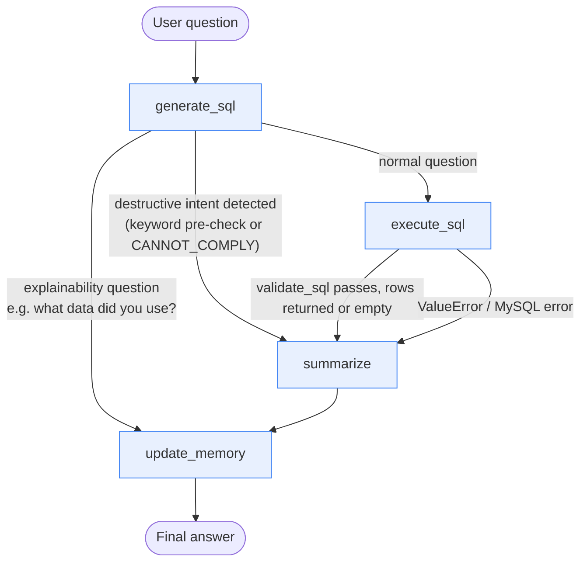

# Architecture Diagram

Retail SQL Data Analyst Agent - LangGraph `StateGraph` (`src/graph.py`).



## Nodes

| Node | Responsibility | Calls the LLM? |
|---|---|---|
| `generate_sql` | Checks for destructive intent (keyword pre-check, zero cost) and explainability questions (answered directly from prior turn's SQL, zero cost) first. Otherwise, prompts the LLM with the full real schema + recent conversation history + follow-up-handling rules to produce one read-only `SELECT`. | Yes, 1 call (skipped for the two special cases above) |
| `execute_sql` | Runs `sql_tools.run_select()`, which validates the SQL via `safety.py` (single-statement, SELECT-only, keyword blocklist) before ever touching MySQL. Catches both safety rejections and MySQL errors into `state["error"]` instead of crashing. | No |
| `summarize` | If `error` is set, relays it directly (no LLM call). If the result is empty (including the `SUM()`-over-zero-rows `NULL` case), returns a grounded "no data" message (no LLM call). Otherwise, one LLM call that summarizes the actual SQL + rows in business language. | Yes, 1 call (skipped for error/no-data cases) |
| `update_memory` | Appends `{question, sql, answer}` to the bounded conversation history (last 5 turns), which threads forward into the next `graph.invoke()` call from `app.py`. | No |

**Cost per question:** at most 2 LLM calls (generate + summarize) for a normal
question; 0 calls for a destructive-intent refusal or an explainability
question - deliberately minimized against the AI Gateway's $2 budget / 10,000
TPM limit.

## State (`AgentState`)

```python
class AgentState(TypedDict):
    question: str        # current user question
    history: list[dict]  # [{question, sql, answer}, ...] - last 5 turns
    sql: str              # generated (or last-used) SQL
    rows: list[dict]      # query result rows
    answer: str            # final business-language answer
    error: str | None       # safety block or execution error, if any
```
